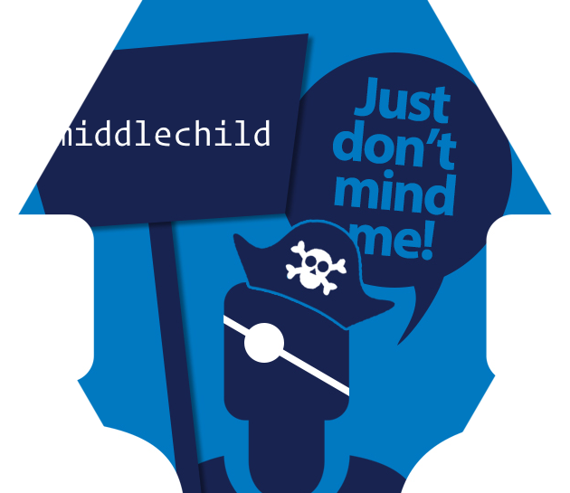

# rOpenSci Unconf 18 Project : middlechild

## Authors:

  - Ildiko Czeller
  - Karthik Ram
  - Bob Rudis
  - Kara Woo

<!-- README.md is generated from README.Rmd. Please edit that file -->

[](https://travis-ci.org/ropenscilabs/middlechild)



# middlechild

Tools to Intercept and Validate Network Traffic

## Description

The ‘mitmproxy’ <https://mitmproxy.org/> project provides tools to
intercept, modify and/or introspect network traffic. Methods are
provided to download, install, configure and launch ‘mitmproxy’ plus
introspect and validate network captures.

Special tools are provided enabling testing of R packages that make API
calls.

## What’s Inside The Tin

The following functions/methods are provided:

  - `call_mitm`: Spawn a mitmdump background process with custom args
    and return the process id
  - `install_mitm`: Helper to get mitmproxy installed
  - `mitm_check`: R CMD check a package (source tree), capturing network
    calls.
  - `mitm_help`: Show the mitmdump help screen
  - `mitm_status`: Check on the status of an mitmproxy process created
    with ‘mitm\_start()’
  - `start_mitm`: Spawn a mitmdump background process in “HAR capture”
    mode and return the process id
  - `stop_mitm`: Stop the mitmproxy background process and retrieve the
    generated HAR file

## Installation

You can install middlechild from github with:

``` r
# install.packages("devtools")
devtools::install_github("ropenscilabs/middlechild")
```

## Examples

### Package Check Usage

``` r
chk <- mitm_check("~/packages/testevil/", quiet = TRUE)
## Loading script: /Library/Frameworks/R.framework/Versions/3.5/Resources/library/middlechild/mitm/har_dump.py
## Proxy server listening at http://*:8080
## Updating testevil documentation
## Loading testevil
## Writing NAMESPACE
## Writing NAMESPACE
## [::1]:59626: clientconnect
## [::1]:59626: GET https://cran.rstudio.com/src/contrib/PACKAGES.rds
##           << 200 OK 292.86k
## [::1]:59626: clientdisconnect
## [::1]:59638: clientconnect
## [::1]:59638: GET http://httpbin.org/
##           << 200 OK 8.15k
## [::1]:59641: clientconnect
## [::1]:59641: GET https://httpbin.org/
##           << 200 OK 8.15k
## [::1]:59641: GET https://httpbin.org/
##           << 200 OK 8.15k
## [::1]:59641: POST https://httpbin.org/post
##           << 200 OK 455b
## [::1]:59641: POST https://httpbin.org/post
##           << 200 OK 438b
## [::1]:59638: clientdisconnect
## [::1]:59641: clientdisconnect
## HAR dump finished (wrote 443307 bytes to file)
## HAR dump finished (wrote 443307 bytes to file)

chk
## # A tibble: 6 x 5
##   issues          req_url                                           method status_code user_agent     
##   <chr>           <chr>                                             <chr>        <int> <chr>          
## 1 Info:CRAN,BadUA https://cran.rstudio.com/src/contrib/PACKAGES.rds GET            200 R (3.5.0 x86_6…
## 2 NoSSL,BadUA     http://httpbin.org/                               GET            200 libcurl/7.54.0…
## 3 BadUA           https://httpbin.org/                              GET            200 libcurl/7.54.0…
## 4 BadUA           https://httpbin.org/                              GET            200 #rstats testev…
## 5 BadUA           https://httpbin.org/post                          POST           200 #rstats testev…
## 6 BadUA           https://httpbin.org/post                          POST           200 libcurl/7.54.0…
```

### General Usage

``` r
pid <- middlechild::start_mitm()

# Visit a cpl sites in Firefox

## Loading script: /Library/Frameworks/R.framework/Versions/3.5/Resources/library/middlechild/mitm/har_dump.py
## Proxy server listening at http://*:8080
## [::1]:59425: clientconnect
## [::1]:59425: GET https://ac.duckduckgo.com/ac/?q=rop&type=list HTTP/2.0
##           << 200  109b
## [::1]:59429: clientconnect
## [::1]:59429: GET https://github.com/ropensci/unconf18/issues/new
##           << 200 OK 17.64k
## [::1]:59434: clientconnect
## [::1]:59435: clientconnect
## [::1]:59434: GET https://avatars1.githubusercontent.com/u/509878?s=40&v=4
##           << 200 OK 3.77k
## [::1]:59435: GET https://avatars3.githubusercontent.com/u/509878?s=88&v=4
##           << 200 OK 13.44k
## [::1]:59442: clientconnect
## [::1]:59442: GET https://live.github.com/_sockets/## VjI6MjQwNzUyNTM5OjIyMDBmYTBmZWE4N2IzOTUyNWVhMTIyMDI5MjY3YTUxMmQ0MWJlYWU1MmE3ZDVhN2ZkYjRhN2U1ZmRlNjAzNDQ=--63b12616e16d863f969a0a969d7407cb70274c66
##           << 101 Switching Protocols 0b
## [::1]:59442 -> WebSocket 1 message -> live.github.com:443/_sockets/## VjI6MjQwNzUyNTM5OjIyMDBmYTBmZWE4N2IzOTUyNWVhMTIyMDI5MjY3YTUxMmQ0MWJlYWU1MmE3ZDVhN2ZkYjRhN2U1ZmRlNjAzNDQ=--63b12616e16d863f969a0a969d7407cb70274c66
## [::1]:59425: GET https://ac.duckduckgo.com/ac/?q=ropensci&type=list HTTP/2.0
##           << 200  121b
## [::1]:59449: clientconnect
## WebSocket connection closed by client: 1001 (message missing), 
## [::1]:59442: clientdisconnect
## [::1]:59449: GET https://ropensci.org/ HTTP/2.0
##           << 200  3.29k
## [::1]:59455: clientconnect
## [::1]:59456: clientconnect
## [::1]:59457: clientconnect
## [::1]:59456: GET https://code.jquery.com/jquery-1.11.3.min.js
##           << 200 OK 37.98k
## [::1]:59457: GET https://d33wubrfki0l68.cloudfront.net/bundles/232fec499deadbe0eed98f0aab215c247b6e01e4.js HTTP/2.0
##           << 200  765b
## [::1]:59457: GET https://d33wubrfki0l68.cloudfront.net/2f1e9494dba713366f999f9e65edc19d917afb18/35faf/img/access.svg HTTP/2.0
##           << 200  2.31k
## [::1]:59457: GET https://d33wubrfki0l68.cloudfront.net/161bc68ec191b312a366ac13b370622bdebf82ce/f833f/img/dataviz.svg HTTP/2.0
##           << 200  1.57k
## [::1]:59457: GET https://d33wubrfki0l68.cloudfront.net/ea493d651fb1be3bc035e94bb1db9f1e2cdb6142/666a2/img/community.svg HTTP/2.0
##           << 200  2.37k
## [::1]:59457: GET https://d33wubrfki0l68.cloudfront.net/dd77315d03290f3570cc09a3b68ea83c09192e72/286f1/img/numfocus.png HTTP/2.0
##           << 200  5.59k
## [::1]:59457: GET https://d33wubrfki0l68.cloudfront.net/88338b7637e084df5c43e7a9e6293719dbaf10e2/30903/img/icon_lettering_white.svg HTTP/2.0
##           << 200  3.49k
## [::1]:59457: GET https://d33wubrfki0l68.cloudfront.net/281a19ebca18b88e8f5666209d827a184aa4e2c1/7c1d4/img/share.svg HTTP/2.0
##           << 200  2.67k
## [::1]:59457: GET https://d33wubrfki0l68.cloudfront.net/aa488a0570cdf44d956942df324bb26cba77c4a2/3919e/img/icon_short_white.svg HTTP/2.0
##           << 200  2.06k
## [::1]:59455: GET https://d33wubrfki0l68.cloudfront.net/css/11b051ae9bd7260e76a56da174785de70763d2e7/css/style-new.css HTTP/2.0
##           << 200  8.48k
## ::1:59455: HTTP/2 connection terminated by client: error code: 0, last stream id: 0, additional data: None
## [::1]:59455: clientdisconnect
## [::1]:59471: clientconnect
## [::1]:59471: GET https://fonts.googleapis.com/css?family=Space+Mono:400,400i,700,700i HTTP/2.0
##           << 200  514b
## [::1]:59457: GET https://d33wubrfki0l68.cloudfront.net/ac95cf374861022e59fd7415650c8a57dda2590d/95d8a/css/fonts/proxima-nova-semibold.woff2 ## HTTP/2.0
##           << 200  71.75k
## [::1]:59457: GET https://d33wubrfki0l68.cloudfront.net/3d05ce28e95874ec7ea1a8be5be16af41d45725b/72414/css/fonts/ropensci.woff HTTP/2.0
##           << 200  2.8k
## [::1]:59457: GET https://d33wubrfki0l68.cloudfront.net/2a39b538b6b85e6e5627049fbb01a5a93cace89d/86a25/img/email.svg HTTP/2.0
##           << 200  348b
## [::1]:59457: GET https://d33wubrfki0l68.cloudfront.net/292e395454c838de5753afe96773358777a6794f/eb013/css/fonts/proxima-nova-regular.woff2 ## HTTP/2.0
##           << 200  71.63k
## [::1]:59457: GET https://d33wubrfki0l68.cloudfront.net/fe867bdb6844368b81ad5d141b0653995128ee86/54fc5/css/fonts/proxima-nova-bold.woff2 HTTP/2.0
##           << 200  72.88k
## [::1]:59457: GET https://d33wubrfki0l68.cloudfront.net/d5f93f5361bc6162c17c43214bfe408a3c0fbc8d/4e296/css/fonts/proxima-nova-regular-italic.woff2 ## HTTP/2.0
##           << 200  72.82k
## [::1]:59449: GET https://ropensci.org/apple-touch-icon.png HTTP/2.0
##           << 200  13.81k
## [::1]:59457: GET https://d33wubrfki0l68.cloudfront.net/img/463da420d885e0fc6a041fd9d3ec0ca90f5da22e/bg_community.png HTTP/2.0
##           << 200  299.88k
## [::1]:59449: GET https://ropensci.org/favicon-32x32.png HTTP/2.0
##           << 200  1.78k
## [::1]:59457: GET https://d33wubrfki0l68.cloudfront.net/img/31984bb5c28e7a3fbc0500242b8cd59bb2e800d6/hero_bg.jpg HTTP/2.0
##           << 200  577.13k
## [::1]:59495: clientconnect
## [::1]:59496: clientconnect
## [::1]:59497: clientconnect
## [::1]:59498: clientconnect
## [::1]:59499: clientconnect
## [::1]:59500: clientconnect
## [::1]:59496: GET https://duckduckgo.com/contentblocking.js?l=easylist&atb=v100-7__&set_atb=v117-7 HTTP/2.0
##           << 304  0b
## [::1]:59495: GET https://duckduckgo.com/contentblocking.js?l=easyprivacy&atb=v100-7__&set_atb=v117-7 HTTP/2.0
##           << 304  0b
## ::1:59495: HTTP/2 connection terminated by client: error code: 0, last stream id: 0, additional data: None
## [::1]:59495: clientdisconnect
## [::1]:59500: GET https://duckduckgo.com/contentblocking.js?l=https2 HTTP/2.0
##           << 304  0b
## ::1:59500: HTTP/2 connection terminated by client: error code: 0, last stream id: 0, additional data: None
## [::1]:59500: clientdisconnect
## [::1]:59499: GET https://duckduckgo.com/contentblocking/trackers-whitelist-temporary.txt HTTP/2.0
##           << 304  0b
## ::1:59499: HTTP/2 connection terminated by client: error code: 0, last stream id: 0, additional data: None
## [::1]:59499: clientdisconnect
## [::1]:59497: GET https://duckduckgo.com/contentblocking.js?l=surrogates&atb=v100-7__&set_atb=v117-7 HTTP/2.0
##           << 304  0b
## ::1:59497: HTTP/2 connection terminated by client: error code: 0, last stream id: 0, additional data: None
## [::1]:59497: clientdisconnect
## [::1]:59498: GET https://duckduckgo.com/contentblocking/trackers-whitelist.txt HTTP/2.0
##           << 304  0b
## ::1:59498: HTTP/2 connection terminated by client: error code: 0, last stream id: 0, additional data: None
## [::1]:59498: clientdisconnect

har <- stop_mitm()

har
## --------HAR VERSION-------- 
## HAR specification version: 1.2 
## --------HAR CREATOR-------- 
## Created by: mitmproxy har_dump 
## version: 0.1 
## --------HAR ENTRIES-------- 
## Number of entries: 34 
## REQUESTS: 
##   -  https://ac.duckduckgo.com/ac/?q=rop&type=list 
##   -  https://github.com/ropensci/unconf18/issues/new 
##   -  https://avatars1.githubusercontent.com/u/509878?s=40&v=4 
##   -  https://avatars3.githubusercontent.com/u/509878?s=88&v=4 
##   -  https://live.github.com/_sockets/VjI6MjQwNzUyNTM5OjIyMDBmYTBmZW... 
##      ........ 
##   -  https://duckduckgo.com/contentblocking.js?l=easyprivacy&atb=v10... 
##   -  https://duckduckgo.com/contentblocking.js?l=https2 
##   -  https://duckduckgo.com/contentblocking/trackers-whitelist-tempo... 
##   -  https://duckduckgo.com/contentblocking.js?l=surrogates&atb=v100... 
##   -  https://duckduckgo.com/contentblocking/trackers-whitelist.txt 
```
